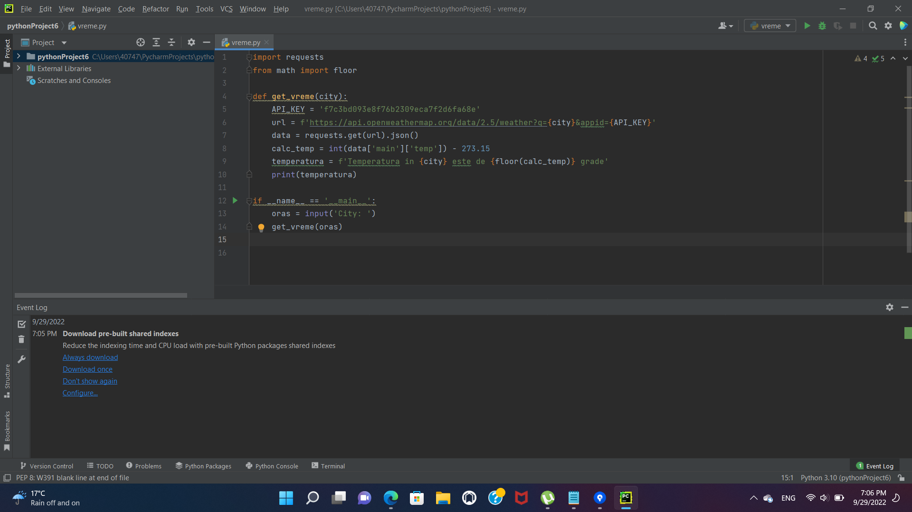

## Despre proiect
Proiectul acesta este o simpla aplicatie de vreme in care user-ul introduce un oras anume pentru a afla datele despre vreme din orasul respectiv.

## Tehnologiile folosite
* Python

## Cateva imagini din culisele proiectului

